# 🎬 Cinema Database System

## 📝 Project Description
The **Cinema Database System** is a comprehensive solution designed to manage cinematic information efficiently. It focuses on organizing and storing data related to movies, directors, and genres, while facilitating online reservations and providing easy data retrieval and analysis for a better user experience.

## 👥 Team Members
This project was a collaborative effort by:
* **Hanen Alshwaimy**
* **Jumanh Aljammaz**
* **Deem Almqhem**
* **Hoor AlOtaibi**
* **Amal Adbullah**

*Supervised by: **Dr. Rund Mahafdah***

## 🛠️ Technical Overview
The project covers the full lifecycle of database design:
1. **ER Diagram:** Mapping entities such as Users, Reservations, Bills, Movies, Rooms, and Tickets.
2. **Relational Schema:** Translating the ER design into a structured relational model.
3. **SQL Implementation:** Practical coding for table creation, data insertion, and querying.

## 🖼️ Project Gallery (Slides 6-22)
Below is a visual walkthrough of our project development:

| Slide | Description | Preview |
| :--- | :--- | :--- |
| **Slide 6** | Overview of project components | 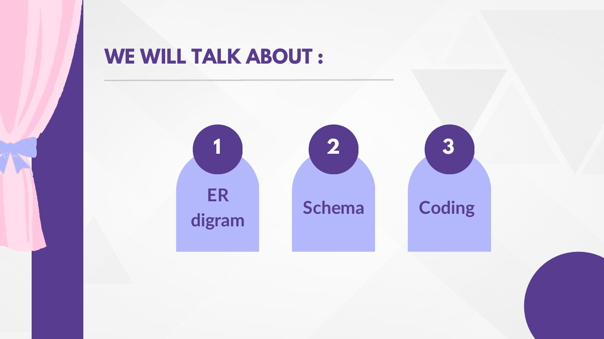 |
| **Slide 7** | Project Entities identification | 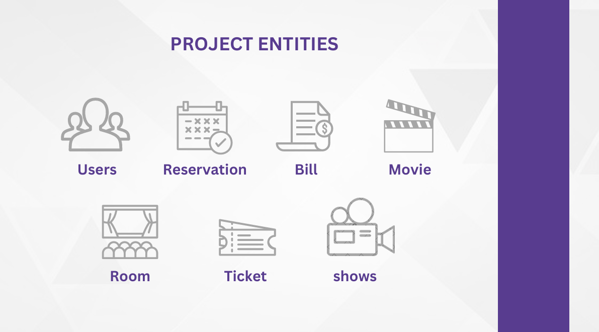 |
| **Slide 8** | Initial ER Diagram | 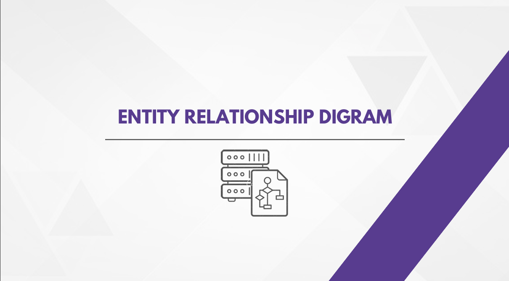 |
| **Slide 9** | ER Diagram Attributes & Details | 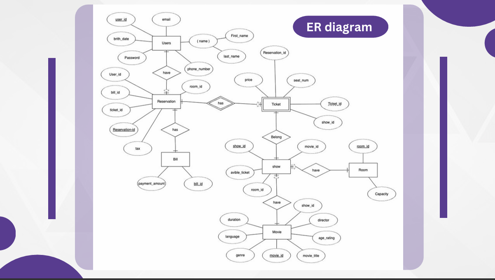 |
| **Slide 10** | Data Types & Structures | 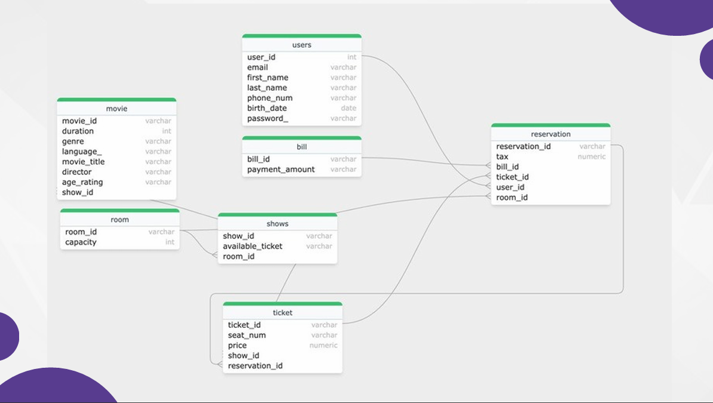 |
| **Slide 11** | Strong Entities (Users, Bill, Reservation, Movie) | 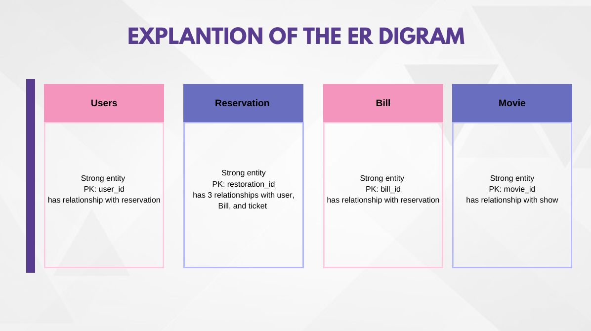 |
| **Slide 12** | Weak Entities & Relationships (Ticket, Room, Shows) | 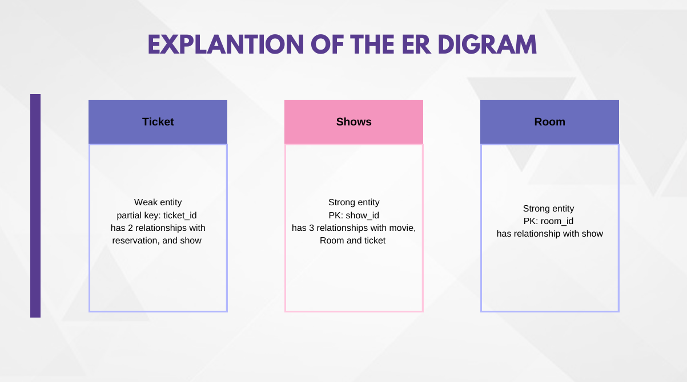 |
| **Slide 13** | Relational Schema Mapping | 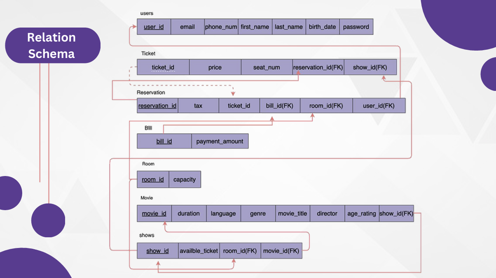 |
| **Slide 14** | SQL Coding - Part 1 | 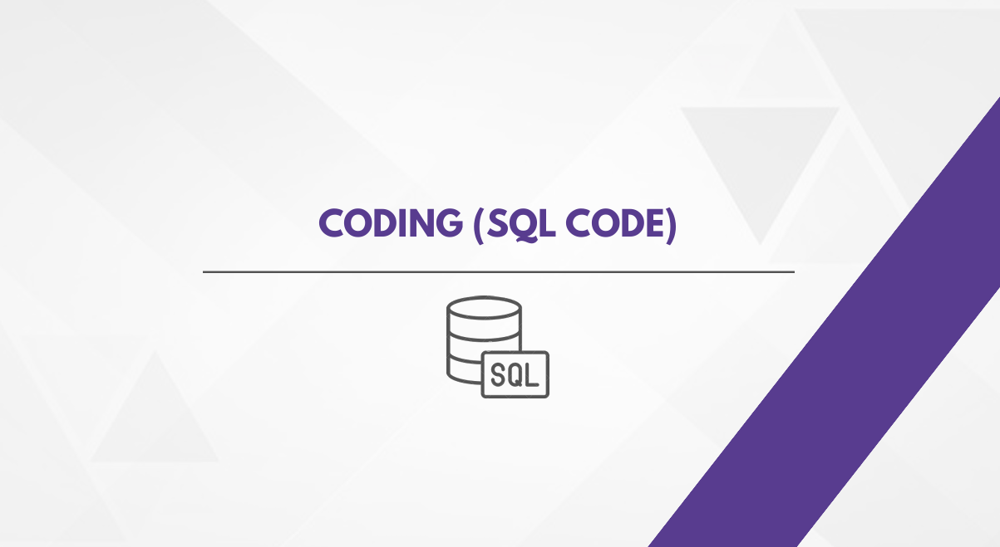 |
| **Slide 15** | SQL Coding - Ticket & Movie Tables | 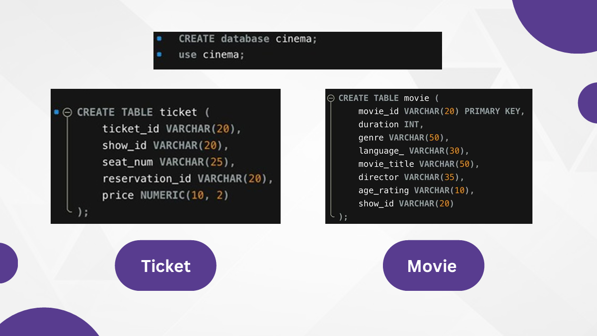 |
| **Slide 16** | SQL Coding - Users & Reservation Tables | 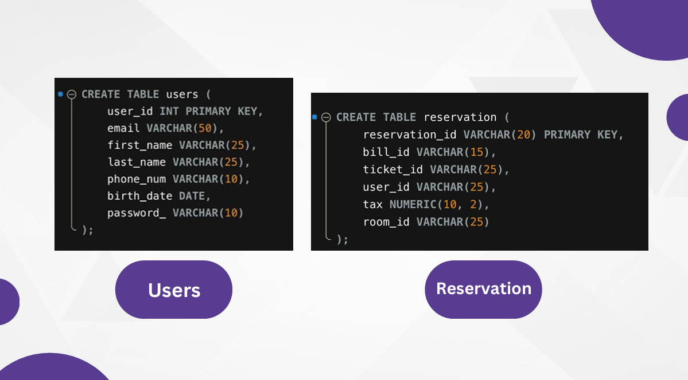 |
| **Slide 17** | SQL Coding - Bill, Room & Shows Tables | 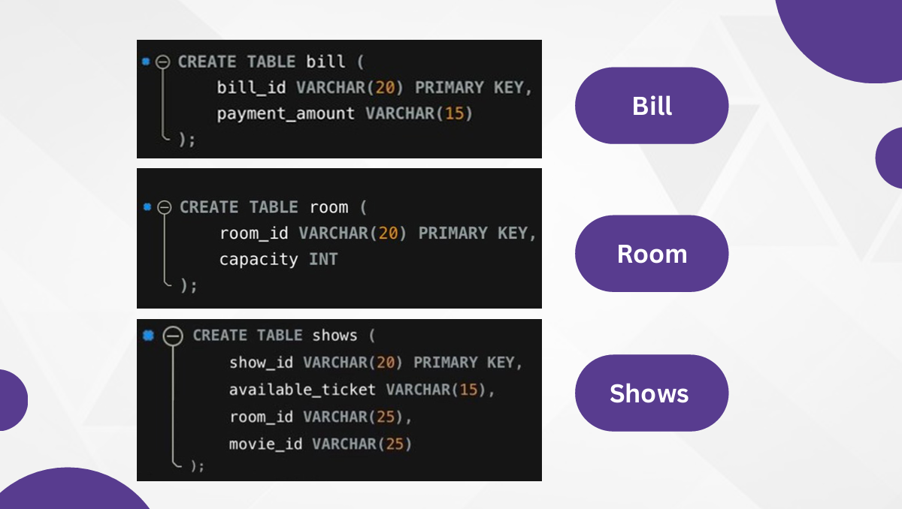 |
| **Slide 18** | Queries and Implementation | 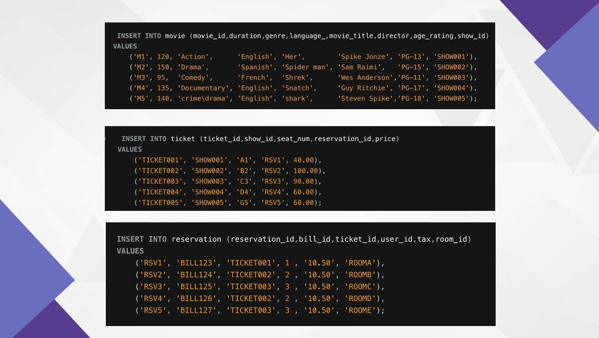 |
| **Slide 19** | Advanced SQL Scripts | 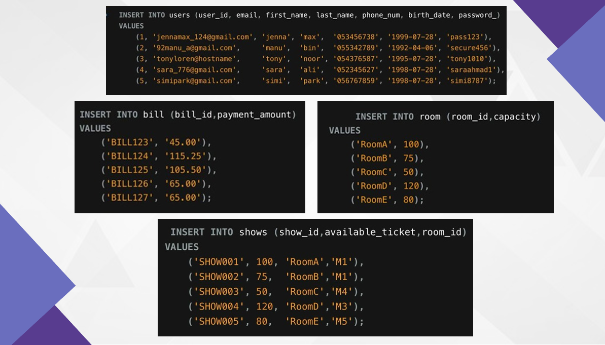 |
| **Slide 20** | System Output - Result 1 | 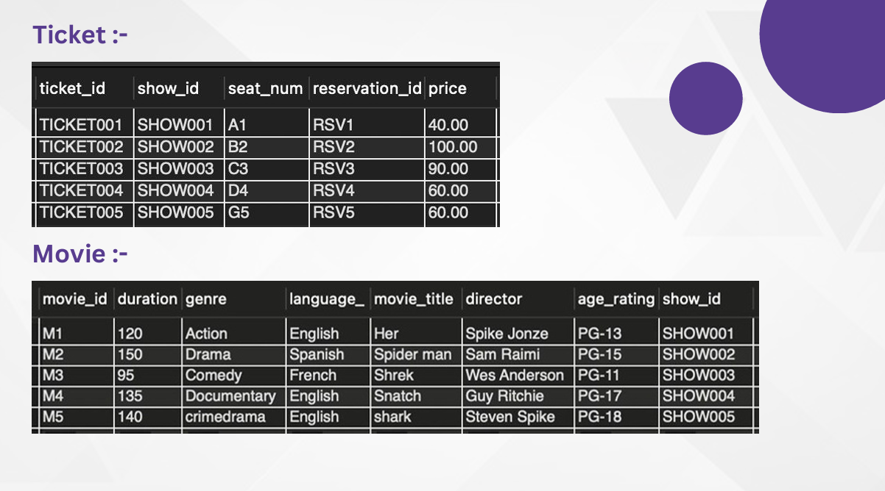 |
| **Slide 21** | System Output - Result 2 | 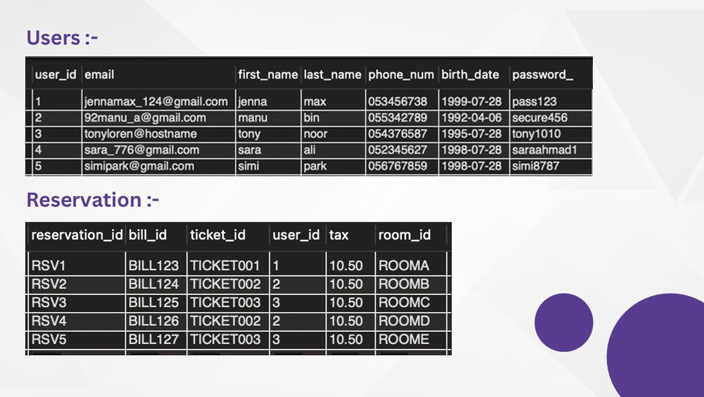 |
| **Slide 22** | Conclusion & Final Summary | 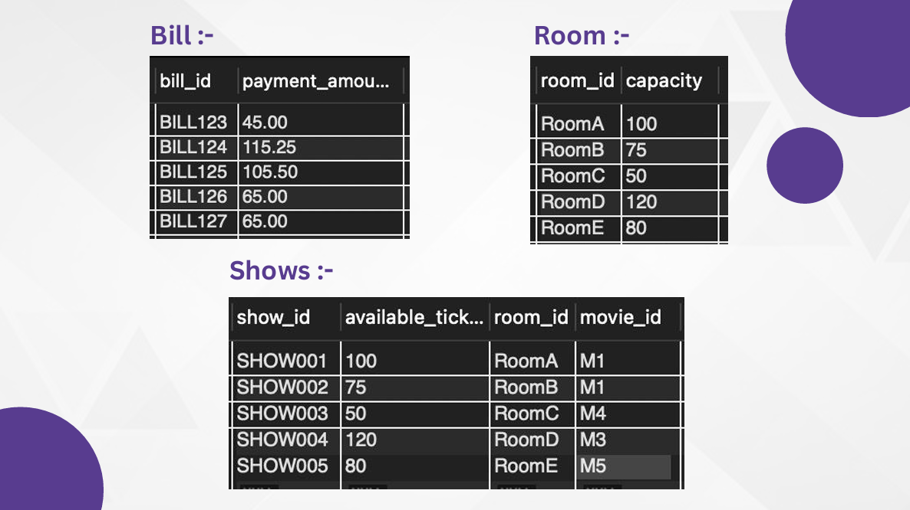 |

---
*Developed as part of the Database Systems course requirements at Shaqra University.*
